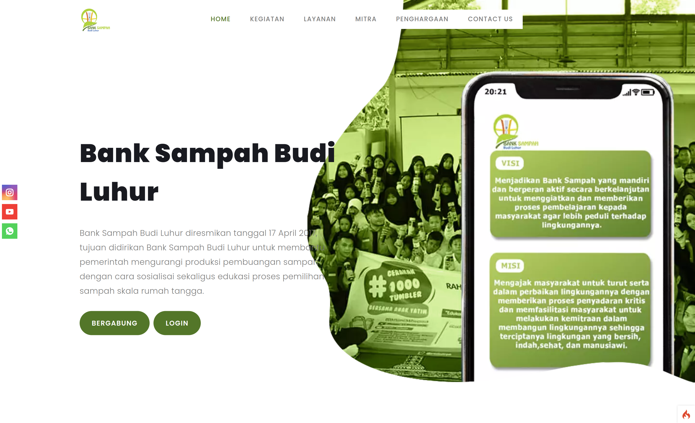
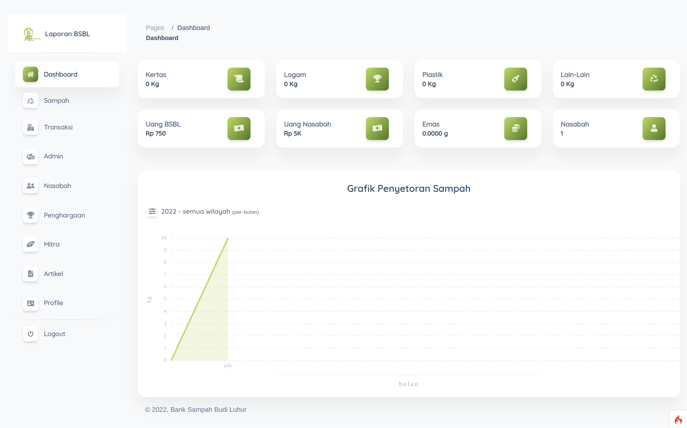

<p align="center">
    <h1 align="center">
        Website Banksampah Budiluhur
    </h1>
</p>

## Requirements

- php 7.3 or higher
- [composer 2.3.4](https://getcomposer.org/)
- mysql

## Setup

<ol>
    <li> Clone <b>or</b> Download as ZIP </li>
    <li> Place the project into htdocs </li>
    <li> Change directory to root project </li>
    <li> Create database <b>db_bsbl</b> </li>
<li> 
run from your cmd:

```
composer install

php spark migrate

php spark db:seed AppSeed
```
</li>
</ol>

## Preview



